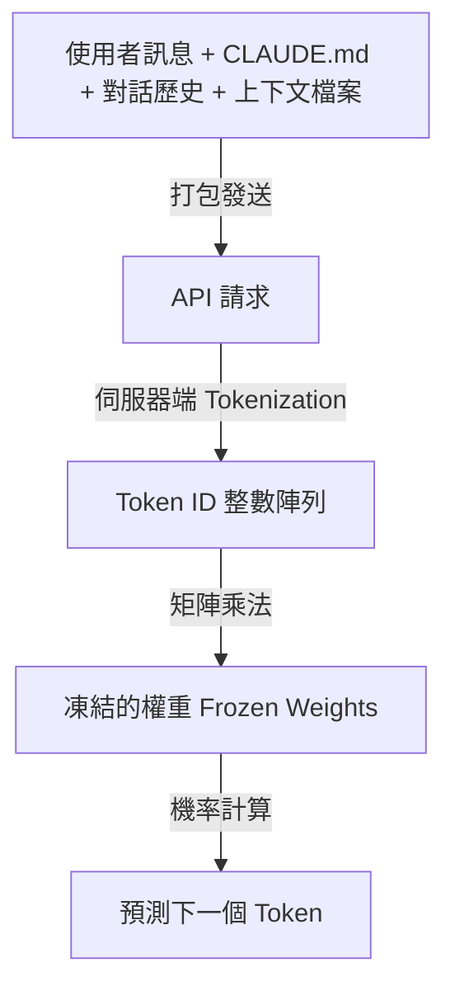
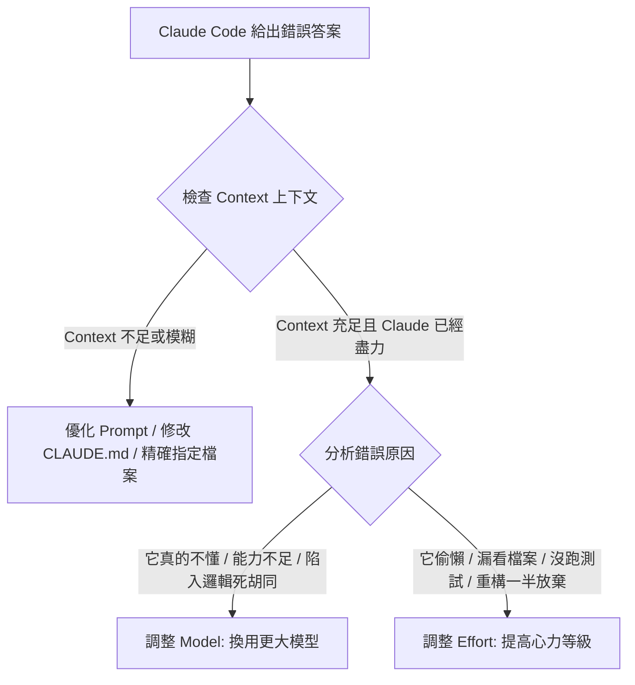

# 人機協同新維度：深度拆解 Claude Code 的模型選擇與心力控制

本導讀旨在拆解 Anthropic 官方發布之 《Choosing a Claude model and effort level in Claude Code》，協助開發者在日常人機協同中建立更精準的直覺：**何時該升級模型（Model），何時該提高心力（Effort）？** 

本文件採用「隱形大師」的複眼視告，融合 **吳恩達**（落地工作流）、**簡立峰**（ROI 戰略）與 **陳縕儂**（人機互動設計）的思考濾鏡，將官方技術指南轉化為具備高度操作性的工程心智模型。

---

## 📂 關聯檔案連結 (Related Files)
*   [README.md](file:///Users/lanss/projects/2_Practice/1150714_test/claude-model-tuning/README.md)：本專案之方法論、生圖 Prompts 與開發歷程記錄。
*   [index.html](file:///Users/lanss/projects/2_Practice/1150714_test/claude-model-tuning/index.html)： Notion 風格的互動式導讀網頁，內含一鍵複製 Prompt 工具箱。

---

## 第一幕：地圖與疆域的本質——唯讀權重與引導 (Weights & Steering)

> **吳恩達點評**：「許多開發者誤以為 AI 是在對話中學習的，但事實上，模型在推理階段（Inference）的本質是『靜態預測』。理解這點，是建立自動化 Agent 工作流的起點。」

當我們在 Claude Code 中按下 Enter 時，背後發生了什麼？



### 1. 唯讀權重（Frozen Weights）的本質
當你的請求被送往 API 時，伺服器會先進行 **Tokenization**（切詞並映射為 vocabulary 的整數 ID）。接著，模型會將這些整數 ID 丟進矩陣，經過一連串的矩陣乘法，輸出下一個 token 的機率分佈。

在整個過程中，**模型權重是完全凍結的**。
*   你的 Prompt、你的 `CLAUDE.md` 或是你放入 Context 的上萬行程式碼，**沒有任何一行會修改模型的權重**。
*   **Steering vs. Teaching**：把文件放入 Context 只是在「引導（Steering）」機率分佈，並非真的在「教導（Teaching）」模型。這種影響僅限於該次請求，模型並不會因此變聰明或「記住」這項知識。

### 2. 幻覺的真相
當 Claude confident 地呼叫了一個根本不存在的 API（幻覺）時，這並不是因為它「查資料失敗」，而是因為唯讀權重根據訓練時留下的模式，計算出這個 token 序列「看起來最合理」。
*   **疆域（Territory）**：程式碼的真實執行環境。
*   **地圖（Map）**：模型唯讀權重中所保留的統計機率模型。
*   **落差來源**：如果一個庫是在模型訓練截止日期後才發布的，那它絕對不會出現在「地圖（權重）」中，你只能透過 Context 來 Steering 它。

---

## 第二幕：通才、專家與專科專家——三種模型的心智模型 (Sonnet, Opus & Fable)

> **陳縕儂點評**：「人機互動的關鍵在於『期望管理』。開發者必須對共事夥伴的能力有清晰的心智模型（Mental Model），否則只會陷入無謂的挫折感中。」

官方針對 Claude 家族在 Claude Code 中的角色，給出了一個非常生動的比喻。我們可以將它們視為三種不同層級的醫生：

| 角色層級 | 代表模型 | 特質與心智模型 | Low Effort (低心力) 表現 | High Effort (高心力) 表現 |
| :--- | :--- | :--- | :--- | :--- |
| **專科專家 (Specialist)** | **Claude Fable 5** | 見過幾乎沒有人看過之疑難雜症的頂尖專家。收費最高，但能解決其餘模型無法觸及的深水區難題。 | 瞥一眼（Low Effort）就能指出大家卡住的關鍵盲點。 | 會調動極大資源，針對極度複雜的多步驟重構進行全面推導。 |
| **專家 (Expert)** | **Claude Opus** | 具備深厚工程直覺的資深工程師。擁有豐富的外部模式識別能力。 | 像諮詢專家 5 分鐘。能迅速指出架構 Gotchas 或程式庫外模式，但不會仔細查閱所有程式碼細節。 | 仔細通讀程式碼，並結合其深厚直覺，給出面面俱到的優化方案。 |
| **優秀通才 (Generalist)** | **Claude Sonnet** | 執行力極強、博聞強記的全科醫生。對上下文中的特定程式碼理解極深。 | 能快速執行精準定義的常規修改，速度快且成本極低。 | 像給通才整個下午。它會讀完所有相關檔案、跑測試、反覆檢查，對你的 codebase 了若指掌，但缺少「一眼看出程式碼外架構盲點」的經驗直覺。 |

### 💡 關鍵直覺
*   **Model 代表「多有能力」（How Capable）**：它決定了天花板高度，以及它所擁有的「固化知識」廣度。
*   **Effort 代表「多徹底」（How Thorough）**：它決定了模型在天花板之下，願意投入多少運算資源（Tokens / Tools / Steps）去探索與確認。

---

## 第三幕：心力 (Effort) 到底在算什麼？ (The Engine of Execution)

> **吳恩達點評**：「在 Agentic Workflow 中，『規劃』與『自我修正』是核心。心力控制（Effort Control）本質上是調整 Agent 在執行 Loop 中的『步幅與驗證閥值』。」

在 Claude Code 中，開發者常誤以為 `Effort` 只是單純的「思考時間（Thinking Time）」。但實際上，心力是一個控制 Claude 實際工作量的手動旋鈕，它影響的是整體的執行引擎：

### 1. 心力的具體工作範疇
當你提高心力級別時，Claude 會在背後悄悄做更多事：
*   **讀取更多檔案**：主動探索更廣泛的關聯代碼。
*   **增加驗證步驟**：更頻繁地跑測試、跑靜態分析或編譯器。
*   **多步驟推進（Step Limit）**：在暫停下來向你詢問/確認之前，它會自主嘗試推得更遠、解決更多中途遇到的依賴問題。

### 2. Token 的本質是一樣的
不論是 Claude 的推理思維鏈（Thinking）、調用工具（Tool calls），還是最後對你說的話（Text to you），在 API 底層都是**同一種輸出 Token**，以同樣的費率計費。

```
[API 輸出 Token 流量] = [Thinking (思維鏈)] + [Tool Calls (呼叫 Read/Edit 等)] + [Response (回覆文字)]
```

### 3. 動態計畫（Dynamic Replanning）
在高心力模式下，Claude 會在第一步先建立計畫。但這個計畫是動態的：
*   如果計畫有 3 個除錯假說，在執行第 1 步時就跑測試抓到了 bug，Claude 會**動態修剪計畫**，跳過假說 2 與 3，直接進入修復與合併。
*   **避免過度思考（Overthinking）**：Anthropic 在訓練時非常克制模型無謂地灌水 token。因此，即使開啟 Max/High Effort，如果任務極度簡單，Claude 也不會故意浪費 token。

---

## 第四幕：黃金診斷法則 (Heuristics for Debugging)

> **簡立峰點評**：「在企業級導入 AI 時，最大的浪費來自於『用高昂的運算成本處理簡單問題』，或是『用低能力配置處理高複雜任務而導致專案失敗』。開發者必須建立這套 ROI 診斷法則。」

當 Claude Code 給出的答案錯了，開發者不應該盲目亂調旋鈕，而是應該依循以下診斷路徑：



### 1. 調整 Model 的訊號：問題「太難了」
*   **特徵**：小模型（Sonnet）給出了非常自信的錯誤答案。你給了它完整的 Context，甚至一行行教它，它依然陷入邏輯死胡同，或者無法理解微妙的併發（Concurrency）Bug。
*   **決策**：**升級模型**（例如從 Sonnet 升級至 Opus 或 Fable）。更大模型能更好地處理高模糊度與複雜架構設計。

### 2. 調整 Effort 的訊號：Claude「不夠努力」
*   **特徵**：Claude 原本可以寫對，但它為了省 Token，選擇不去讀某個定義檔，或者修改完代碼後沒有跑測試，導致漏掉邊際狀況（Edge Cases）；或者重構到一半，因為步驟太多就直接 bail out（放棄並向你提問）。
*   **決策**：**提高 Effort**。迫使它進行更徹底的雙重檢查，直到信心水準達標才返回。

---

## 第五幕：邊際成本與 Token 經濟學 (Token Economics)

> **簡立峰點評**：「這是一場經典的運算經濟學遊戲。大模型的 per-token 價格極高，但如果用小模型反覆嘗試（Iterations）失敗，所累積的 tokens 費用與時間成本反而更高。ROI 的最佳平衡點是動態的。」

### 1. 例行公事（Routine Work）的 ROI
*   **特徵**：精確的代碼修改、寫單元測試、或是詢問已有 Context 的代碼問題。
*   **經濟策略**：使用 **小模型（Sonnet）+ 預設/低 Effort**。大模型在這種任務上會產生多餘的驗證步驟，不僅 per-token 費率高，還會消耗更多無謂的 tokens，造成雙重浪費。

### 2. 複雜任務（Ambiguous Work）的 ROI
*   **特徵**：多步驟、大範圍的架構調整，或是未知的系統 Bug。
*   **經濟策略**：使用 **大模型（Fable / Opus）+ 高 Effort**。
    *   小模型在極限邊緣掙扎時，會不斷出錯、重試，燒掉大量的 iteration loops，累積龐大的 token 帳單。
    *   大模型雖然單價貴，但通常能在極少步數內一次到位，**最終的總成本（Time + Token Cost）反而更低**。

### 3. 軟性控制 vs. 硬性截斷
*   `max_tokens`：API 的硬性上限，會像一堵牆一樣直接在中間粗暴截斷 output，不建議作為日常控制手段。
*   **軟性上限（Soft Limits）**：例如在 Prompt 中加上「keep it brief（保持簡潔）」或設定 `task budget`。Claude 被訓練成會主動在接近軟性上限時進行「收尾」，產出更具結構性且完整的結論。

---

## 🛠️ 開發者工具箱：黃金對齊 Prompts (Prompts Toolbox)

這些 Prompts 已收錄於互動網頁 [index.html](file:///Users/lanss/projects/2_Practice/1150714_test/claude-model-tuning/index.html) 中，提供一鍵複製。

### 1. 實作前：盲點檢視 (Blind Spot Pass)
> 用於開始大規模重構或全新功能開發前，迫使 AI 列出「它不知道、而你可能沒給」的資訊。

```markdown
我們即將開始實作以下任務：[填入任務描述]。
在開始寫任何程式碼或制定計畫之前，請先進行「盲點檢視（Blind Spot Pass）」：
1. 列出你目前 Context 中缺失的關鍵上下文（例如未讀取的檔案、環境配置、依賴庫版本）。
2. 指出該任務中可能存在的「未知未知（Unknown Unknowns）」，並提出 3 個你需要我澄清的關鍵設計決策。
先不要提供實作計畫，等我回覆你的提問。
```

### 2. 實作中：偏差記錄 (Deviations Logger)
> 當開發進行到一半，AI 決定偏離原有的 spec 或架構設計時，要求它建立記錄。

```markdown
在接下來的修改中，如果發現實際程式碼現況與我們原先的設計計畫有落差，或是需要做出折衷設計（Trade-off），請立即暫停並更新我們的 `implementation-notes.md`：
1. 記錄偏離的原因與當前的程式碼限制。
2. 列出當前決策對系統其他模組的潛在影響（Side Effects）。
3. 提出修正後的替代方案，等我確認後再繼續。
```

### 3. 實作後：程式碼異動隨堂測驗 (Quiz before Merge)
> 在合併程式碼前，確保開發者自己完全掌握 AI 生成的代碼邏輯，而非盲目 Merge。

```markdown
你已經完成了代碼修改。在我們進行 Git Commit 與 Merge 之前，請為我出一份包含 3 個問題的「隨堂測驗（Quiz）」：
1. 針對你剛剛修改中最微妙的邏輯、臨界值處理（Edge Case）或潛在的 Concurrency 點進行提問。
2. 題目必須是選擇題或簡答題，旨在測試我是否真正理解你的修改，而非盲目相信你的代碼。
請只出題，等我回答後再批改並給出解釋。
```
