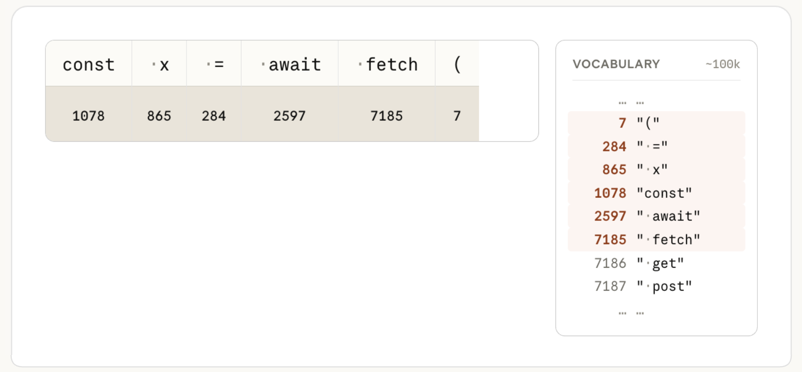
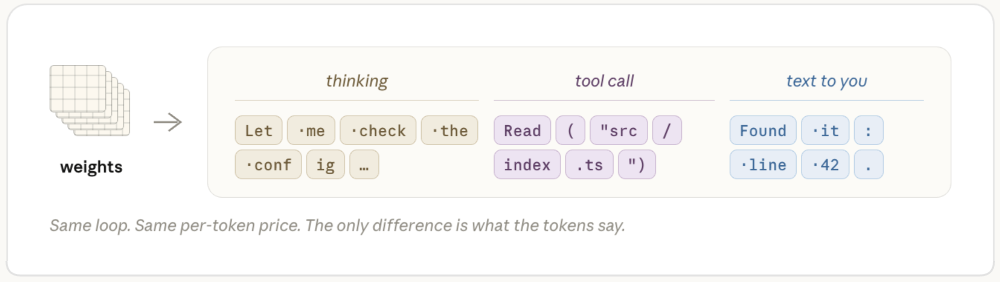

# 換模型還是加心力？拆解 Claude Code 那顆最常被轉錯的旋鈕

你一定遇過這個場景：Claude Code 給出的答案不對。直覺反應通常是兩個按鈕二選一——換一顆更貴的模型，或者把 Effort 轉到最高。但很多人選錯的次數，比選對的次數還多。換了 Fable，結果它一樣栽在同一個坑；轉到 Max Effort，結果只是把同一個錯誤答案，用更多字數、更貴的帳單，講得更有自信而已。

問題不在於「要不要花更多錢」，而在於你根本沒有分清楚，Claude 這次是**不會**，還是**沒認真**。這兩件事的解法完全不同，混在一起處理，就是台灣工程師最常在 Claude Code 帳單上多繳的那筆冤枉錢。

## 舊直覺為什麼會失靈

多數人對「加大力度」的直覺，來自過去用慣的工具邏輯：解析度不夠就加畫質、跑不動就加算力、印表機模糊就多印幾次。這套邏輯放在 Claude 身上會失靈，因為它把兩種完全不同的東西，錯當成同一個旋鈕。

一個是**模型**——決定 Claude「懂不懂」這件事。另一個是**心力（Effort）**——決定 Claude「願意花多少工夫」把懂的東西做確實。前者是天花板，後者是你允許它在天花板底下走多遠。把心力轉到最大，天花板不會變高；换成更大的模型，如果問題本身只是它偷懶漏看一個檔案，你也只是用更貴的方式重複同一個懶惰。

要搞懂什麼時候該動哪一個旋鈕，得先打開機蓋，看看 Claude 回話之前，到底發生了什麼事。

## 機蓋底下：一顆唯讀的權重，和一個花錢的迴圈

先講模型。當你的訊息連同 CLAUDE.md、對話紀錄、你打開的檔案一起送出去，伺服器做的第一件事是**斷詞（Tokenization）**——把文字切成一個個對應到詞彙表的整數編號。下面這張圖示範了這個過程：一段程式碼被拆成 `const`、`x`、`=`、`await`、`fetch`、`(` 這幾塊，每一塊對應一個固定的數字 ID，詞彙表裡大約有十萬個這樣的編號在候補。

<figure class="section-figure">
  
  <figcaption>文字送進模型前，先被切成整數 ID——這一步和模型「聰不聰明」無關，純粹是格式轉換。</figcaption>
</figure>

這串數字接著會撞進模型的權重——一組在訓練階段就已經定型、數量高達數十億的參數矩陣。關鍵字是「定型」：權重在你送出請求的當下，是**唯讀**的。你的 Prompt 寫得再仔細、CLAUDE.md 堆得再厚，都不會改寫任何一個參數，只是在幫這次的機率計算「指路」——業界說法是 **Steering（引導）**，而不是 **Teaching（教導）**。這也是為什麼 Claude 不會因為你這次對話教了它一個新知識，下次就自動記得：它下次還是同一組唯讀權重，從零開始重新推理。

<figure class="section-figure">
  
  <figcaption>權重訓練完就鎖死了。你的 Context 只能引導這次的機率分布，不會寫回模型本身。</figcaption>
</figure>

這也順便解釋了「幻覺」是怎麼一回事。Claude 自信地呼叫一個根本不存在的函式，不是因為它「查不到資料」，而是唯讀權重根據訓練時看過的統計模式，算出這串 token「看起來最合理」。如果一個套件是模型訓練截止日之後才發布的，它就永遠不會出現在權重的統計模型裡——你唯一能做的，是透過 Context 把正確答案「引導」進這次的推理，而不是期待模型自己「想起來」。

那心力（Effort）在算什麼？它不是一根控制「思考時間」的旋鈕，而是控制 Claude 在同一組權重底下，願意跑幾輪這個迴圈：讀幾個檔案、驗證幾次、中途卡關時要不要自己想辦法排除，還是直接停下來問你。下圖是同一個「修一個測試失敗」的任務，在低心力和高心力下實際的執行軌跡：低心力讀一個檔案就動手改，順手回報「改好了」；高心力則會多讀設定檔和來源檔案、想一下、改完還跑測試驗證，最後給出一個交代清楚問題根因的結論。同一組權重，同一個「懂不懂」的天花板，但因為多繞了幾步路，答案的完整度差了一大截。

<figure class="section-figure">
  
  <figcaption>同一個任務，低心力和高心力走的是完全不同長度的路——多出來的步驟不是「想更久」，是「多做了幾件事」。</figcaption>
</figure>

而不管 Claude 是在思考、呼叫工具讀檔案，還是把結果打成文字回你，這三種輸出在計費上其實是同一種東西——都是 token，都用同一個費率算錢。

<figure class="section-figure">
  
  <figcaption>思考、呼叫工具、回你話——底層都是同一個迴圈吐出來的 token，價格沒有差別，差的只是這次吐出來的內容是什麼。</figcaption>
</figure>

搞懂這點之後，「轉錯旋鈕」的代價就很具體了：你以為多花的錢是在買「更聰明」，實際上買到的可能只是「同樣的答案，多繞了幾圈路再講一次」。

## 判斷的關鍵，不是「錯了」，而是「怎麼錯的」

當 Claude 給錯答案，先別急著動旋鈕。第一件事是確認 Context 本身夠不夠——如果連檔案路徑、規格、限制條件都沒給齊，不管換多貴的模型、開多高的心力，都是在拿石頭考瞎子。Context 補齊之後如果還是錯，才輪到判斷「它到底是怎麼錯的」。

<figure class="section-figure">
  
  <figcaption>兩條岔路：漏做事，是心力不夠；讀完了還是錯，是能力不夠。分不清這兩者，旋鈕永遠轉錯邊。</figcaption>
</figure>

左邊那條路——它明明有能力做對，卻漏看了一個檔案、沒跑測試、或是重構到一半就放棄丟回來問你——這是**心力不足**的訊號，對策是提高 Effort，逼它把該做的驗證步驟走完。右邊那條路——它讀完了所有你給的東西，態度也很認真，但答案依然自信地錯，通常是碰到細膩的併發問題、陌生的領域知識，或是邏輯本身卡進死胡同——這才是**能力不足**的訊號，對策是換一顆更大的模型。這兩種錯誤長得很像（都是「答案不對」），但背後的成因完全不同，對策也完全不能互換。

## 錢要花在哪一邊，答案其實是算出來的

搞懂診斷之後，還有一層更現實的問題：多花的錢，到底值不值得？這裡的直覺同樣容易出錯——很多人以為「反正大模型比較強，乾脆什麼任務都用大模型跑高心力」最保險。實際攤開兩條任務類型的成本曲線，答案完全相反。

先看例行任務——像是照著明確規格改一小段程式碼、補一個單元測試。這種任務兩種模型幾乎立刻就能碰到品質天花板，再往上加心力，買到的只是「多驗證幾次」，品質曲線幾乎是平的。

<figure class="section-figure">
  
  <figcaption>簡單任務上，大模型和小模型幾乎同時撞到同一片天花板——過線之後多花的每一分錢，都只是在重複確認同一個答案。</figcaption>
</figure>

再看複雜任務——多步驟的架構調整、邊界模糊的疑難雜症。這時候兩條曲線會明顯拉開：大模型的天花板本來就比較高，而且達到同樣品質所需要的 token 量，反而比小模型少更多。

<figure class="section-figure">
  
  <figcaption>複雜任務反過來——小模型得燒掉大量 token 一路試錯才勉強逼近，大模型用中等心力就先一步到位，「same quality, fewer tokens」不是廣告詞，是這條曲線自己畫出來的。</figcaption>
</figure>

這兩張圖合起來，其實是同一個結論的兩面：例行工作把預算留在小模型、預設心力就好，省下來的錢比你想像的多；真正模糊、多步驟、容易讓小模型反覆試錯燒錢的任務，才值得一開始就上大模型、開高心力——因為小模型在那種任務上，「便宜」只是帳面上的錯覺，它燒掉的迭代次數最後往往比大模型的單價還貴。

## 落地：下一次卡關前，先問對問題

把整個判斷收斂成一句話能記住的版本：**先確認 Context 給齊了沒；答案還是錯，再問「它是不懂，還是沒盡力」——不懂換模型，沒盡力加心力，兩者都對不上號，就別亂轉旋鈕。**

實務上更好的做法，是不要每個任務都臨時決定。多數團隊比較有效率的方式，是先依你的專案性質（例行維護 vs. 高複雜度重構）設一個預設組合，只有在真的踩到上面那個判斷分岔時，才臨時覆寫；而不是每次卡關都從頭猜一次要調哪顆旋鈕。把這套判斷內化成反射動作之後，你會發現多數時候真正該做的，不是換模型或加心力，而是回頭把 Context 補齊——那往往才是最便宜、也最快見效的一步。
